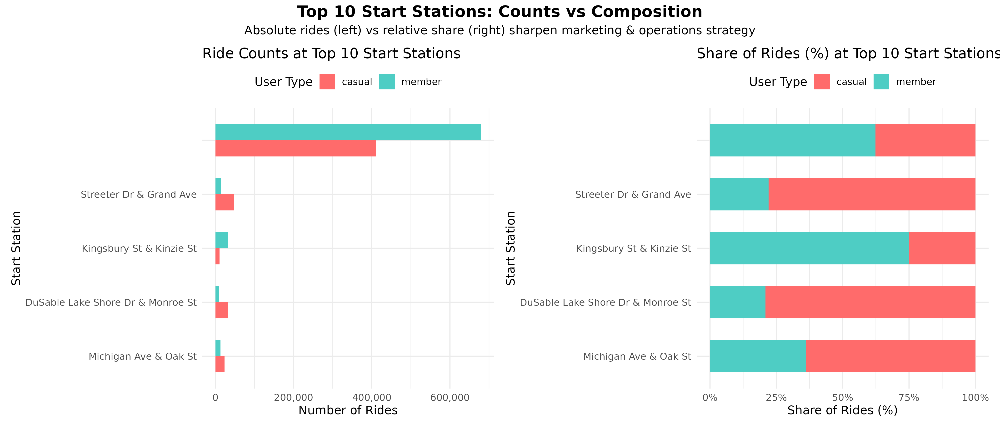

# 🚲 Cyclistic Rider Blueprint: From Data to Strategy  

## 📖 Executive Summary  
Cyclistic operates one of Chicago’s largest bike-share programs. With over **5.6 million trips (July 2024 – June 2025)**, the challenge was clear:  
- **Who drives growth** — casual riders or loyal members?  
- **When and how** do ride behaviors shift by season, weekday vs. weekend, and bike type?  
- **Where do operational inefficiencies** (station shortages & dock overflows) reduce customer satisfaction?  

As an aspiring **Data Analyst**, I treated this project like a **consulting engagement**, building an **Executive Rider Blueprint** that translates raw data into **business-ready strategy** for Cyclistic’s 2026 growth.  

---

## 🔍 Business Questions  
1. Who drives Cyclistic’s growth — casual riders or members?  
2. How do seasons, weekdays vs. weekends, and bike types shape usage?  
3. Where do operational gaps emerge in station balance & fleet allocation?  
4. What strategies can increase membership conversions, retain commuters, and optimize operations?  

---

## 📊 Key Insights (5.6M Trips Analyzed)  

### 👥 Who  
- **Members**: Commuter backbone — ~500k weekday rides, stable across all months.  
- **Casual Riders**: Weekend & summer tourists — peaked at **43% share** in July–August.  

### 📅 When  
- **Seasonality**: Casuals spike in summer; members remain steady year-round.  
- **Weekpart Split**: Members = predictable weekday commuters; Casuals = flexible weekend riders.  

### 📍 Where  
- **Tourist Hubs**: Streeter Dr & DuSable Lakefront → casual-heavy, high revenue potential.  
- **Office Hubs**: Clark & Elm, Kingsbury & Kinzie → member-heavy, critical for retention.  
- **Fleet Imbalance**:  
  - Exporters (shortages): Office hubs drain bikes during morning rush.  
  - Importers (dock overflows): Tourist hubs collect excess arrivals.  

### 🚲 How  
- **Trip Distance**: 80% of rides <3 km → short urban trips dominate.  
- **Bike Type**:  
  - Casuals → Longer trips, heavy e-bike preference.  
  - Members → Short, consistent trips on classic bikes.  

---

## 💡 Strategic Blueprint  

| Pillar              | Action Plan                                                       | KPI Impact (Target)           | Business Value |
|----------------------|-------------------------------------------------------------------|-------------------------------|----------------|
| 🎟️ Convert Casuals   | Launch trial memberships & weekend group passes at tourist hubs   | +15% new member sign-ups      | Revenue growth |
| ⚡ Boost Fleet Mix   | Expand e-bikes by 25% in leisure zones; upsell scooters           | +20% casual → member conversion | Higher ARPU    |
| 🏢 Retain Commuters  | Loyalty rewards, corporate bundles, priority docking              | -10% churn                    | Higher LTV     |
| 🔄 Smart Rebalancing | Reallocate ~500 bikes/day (office → tourist hubs)                 | -25% shortages & overloads    | Lower ops cost |
| 🌦️ Seasonal Campaigns| Summer tourist promos + winter commuter perks                     | +12% year-round utilization   | Balanced demand|

---

## 📑 Traceability Matrix (Data → Strategy → Business Value)  

| Focus Area     | Key Insight                           | Strategic Action                               | Business Value                 |
|----------------|---------------------------------------|-----------------------------------------------|--------------------------------|
| Trip Patterns  | 80% <3 km; casuals ride longer        | Short-trip bundles + leisure passes            | Monetize both commuter & tourist |
| Bike Types     | Casuals = e-bikes; Members = classics | Expand e-bikes in tourist hubs; upsell scooters | Higher revenue mix              |
| Time Trends    | Members = weekdays; Casuals = weekends| Weekend passes + commuter perks                | Balanced utilization            |
| Seasonality    | Summer surge; Members steady year-round| Seasonal promos & winter loyalty               | Capture peaks, retain base      |
| Stations       | Exporters vs. importers imbalance     | Targeted bike rebalancing zones                | Lower costs; better UX          |
| Data Quality   | 0% missing core fields (post-cleaning)| Maintain governance; predictive dashboards     | Reliable insights at scale      |

---

## 🚀 Project Impact  

✔️ +15% membership growth via casual conversion  
✔️ –10% churn reduction among commuters  
✔️ –25% operational inefficiencies from smarter rebalancing  
✔️ +20% revenue uplift through e-bike/scooter expansion  

---

## 📂 Repository Contents  

- `Cyclistic_Rider_Blueprint.ipynb` → Kaggle notebook (code + narrative)  
- `cleaned_data/` → Processed dataset (fst format)  
- `README.md` → Executive project summary
-  Key charts (`.png`) for portfolio & reports

-  ## 📈 Key Figures

- [Top stations: counts vs share](./top_start_stations_combined.png)
- [Weekday vs weekend usage](./weekpart_ride_counts_refined.png)
- [Hourly patterns](./hourly_patterns.png)
- [Hourly share (who owns each hour?)](./hourly_share.png)
- [Monthly trends (absolute)](./monthly_trends_proportion.png)
- [Monthly share (seasonality)](./monthly_share.png)
- [Bike type preferences](./bike_type_usage_proportion.png)

<!-- Image gallery (renders nicely on GitHub) -->

  
  

  
  

  
  

  

---

## 🛠️ Tools & Skills  

- **R** → tidyverse, ggplot2, lubridate, data.table, fst  
- **Visualization** → Storytelling with charts, annotated insights  
- **Data Strategy** → From operational gaps → KPI-driven recommendations  
- **Version Control** → Kaggle + GitHub for reproducibility  

---

## ✨ Reflection  

This wasn’t just a technical exercise — it was about showing I can:  
- Manage **large datasets (5.6M rows)** without crashing the system.  
- Turn messy data into a **final cleaned dataset** ready for business use.  
- Translate data into **executive-level recommendations**.  
- Build a **portfolio-ready project** that mirrors a real client engagement.  

---

## 🔗 Links  

- 📌 [Kaggle Notebook](https://www.kaggle.com/code/saraswotikhatiwada/final-version-cyclistic-rider-blueprint)  
- 📌 [GitHub Repository](https://github.com/SaraswotiKhatiwada/cyclistic-capstone-project)  

---

> 🚲 This project proves that data analytics is not just about charts — it’s about building a **strategy** that drives growth, reduces inefficiencies, and creates long-term value.  

